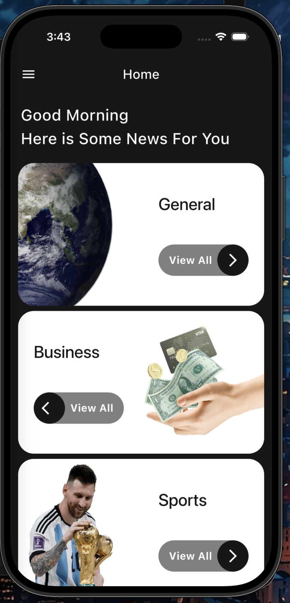
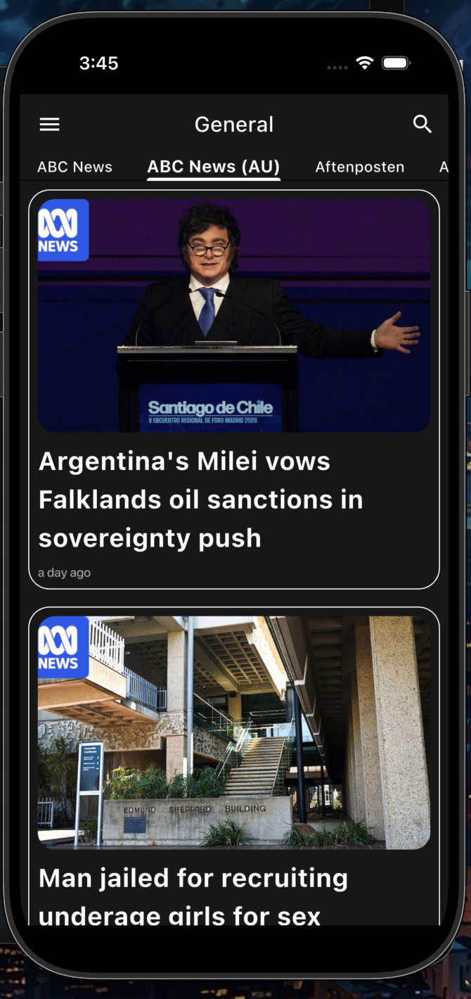
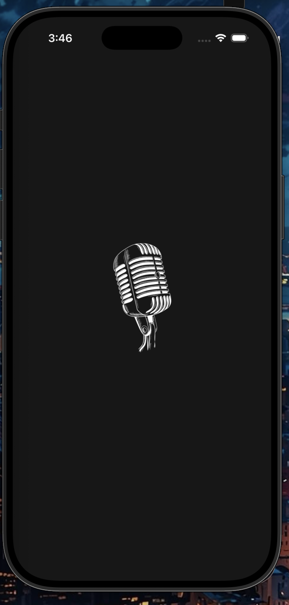

# 📰 News App

A modern, responsive news application built with **Flutter**. It delivers real-time global and local news across multiple categories, featuring full Dark Mode support, offline caching, and seamless in-app article browsing.

---

## 🚀 Features

* 🔍 **Instant Search:** Quickly search for articles and news updates using custom keywords.
* 🏷️ **Category Filtering:** Browse news by topics (General, Business, Sports, Health, Technology, Entertainment, Science).
* 🌐 **In-App WebView:** Read full articles directly from their original sources without leaving the application.
* 📄 **Article Bottom Sheet:** Preview key details and jump straight into the full article.
* 🌗 **Theme Support:** Full support for both Light and Dark themes for a comfortable reading experience.
* 💾 **Local Caching:** Store and retrieve data locally using Hive for offline access.
* 📡 **Robust Error Handling:** Smooth user experience during network disconnects and data loading.

---

## 🛠️ Tech Stack & Packages

* **Framework:** Flutter (Dart)
* **Architecture:** MVVM (Model-View-ViewModel)
* **State Management:** Flutter Bloc & Provider
* **Networking:** Dio & Pretty Dio Logger
* **Local Storage:** Hive Flutter
* **UI Components:** WebView Flutter, Cached Network Image, Timeago

---

## 📸 Screenshots

| Home Screen | Article Sheet | Splash Screen |
| :---: | :---: | :---: |
|  |  |  |

---

## ⚙️ Getting Started

1. **Clone the repository:**
   ```bash
   git clone [https://github.com/AhmedSalah363/news_app.git](https://github.com/AhmedSalah363/news_app.git)
